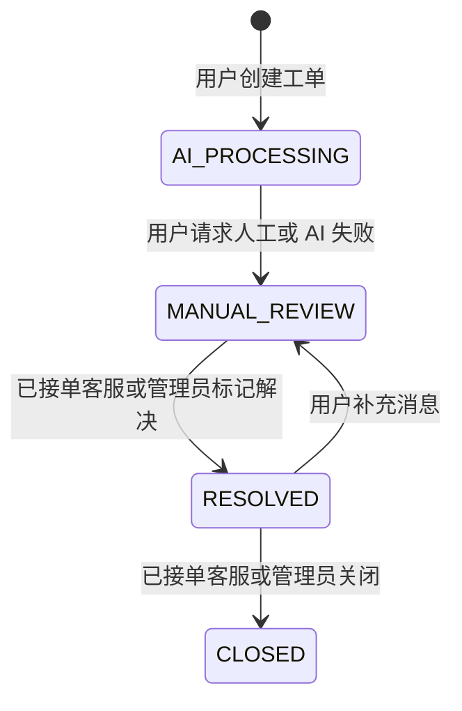

# 成员 C 工单、策略与 AI 接口说明

> 基线：`develop` 分支，2026-07-28
> 统一前缀：前端访问 `/api`，Vite 代理到后端 `http://localhost:8080`
> 鉴权：除登录/注册外均携带 `Authorization: Bearer <token>`

## 1. 工单状态机



客户端不能直接提交 `status` 或 `agentId`。接单、分配、解决、关闭均使用专用接口；状态冲突返回 HTTP 409。

## 2. 工单接口

| 方法与路径 | 权限 | 请求体 / 说明 |
| --- | --- | --- |
| `GET /tickets?current=1&size=10` | `ticket:query` | 分页；USER 仅本人，AGENT 按可处理范围，ADMIN 全量 |
| `GET /tickets/{ticketId}` | `ticket:query` | 返回详情、处理客服、消息、SLA、解决/关闭时间 |
| `GET /tickets/{ticketId}/messages` | `ticket:query` | 返回有权限工单的消息 |
| `GET /tickets/{ticketId}/logs` | `ticket:query` | 返回不可修改的操作日志 |
| `POST /tickets` | `ticket:add` | `{orderId,title,description,category?,priority?}` |
| `POST /tickets/{ticketId}/messages` | `ticket:message` | `{content}` |
| `POST /tickets/{ticketId}/transfer-manual` | `ticket:message` | 所属 USER 在 AI 处理中主动转人工 |
| `POST /tickets/{ticketId}/claim` | `ticket:claim` | AGENT 原子接取尚未分配的人工工单 |
| `PUT /tickets/{ticketId}/assignee` | `ticket:assign` | ADMIN；`{agentId}` |
| `POST /tickets/{ticketId}/resolve` | `ticket:resolve` | 已接单 AGENT/ADMIN；`{content}` |
| `POST /tickets/{ticketId}/close` | `ticket:close` | 已接单 AGENT/ADMIN；`{reason}` |

创建工单时根据命中策略的 `slaHours` 计算 SLA；未命中时按优先级使用 `LOW=72`、`MEDIUM=48`、`HIGH=24`、`URGENT=4` 小时。定时任务在剩余时间不超过总时长 25% 时预警，逾期后提升一级优先级并记录日志。

## 3. 售后策略接口

以下接口均要求管理员权限 `policy:manage`：

| 方法与路径 | 说明 |
| --- | --- |
| `GET /policies?current=1&size=10&category=REFUND&enabled=1` | 分页筛选 |
| `GET /policies/{id}` | 查询详情 |
| `POST /policies` | 创建策略 |
| `PUT /policies/{id}` | 修改策略 |
| `PATCH /policies/{id}/enabled` | 请求体 `{enabled: 0或1}` |
| `DELETE /policies/{id}` | 逻辑删除 |

创建/修改请求示例：

```json
{
  "policyName": "物流延迟人工复核",
  "category": "LOGISTICS",
  "conditionType": "ALWAYS",
  "minAmount": null,
  "maxAmount": null,
  "minReputation": null,
  "action": "MANUAL",
  "replyTemplate": "已为您转交人工客服核查。",
  "priority": 1,
  "enabled": 1,
  "slaHours": 24
}
```

## 4. FAQ 接口

- `GET /faqs/search?keyword=物流&category=LOGISTICS`：三类登录角色均可检索，只返回启用且未删除的数据，最多 20 条。
- 管理员可使用 `GET /faqs`、`GET /faqs/{id}`、`POST /faqs`、`PUT /faqs/{id}`、`DELETE /faqs/{id}`。

FAQ 写入请求：

```json
{
  "category": "LOGISTICS",
  "question": "物流长时间不更新怎么办？",
  "answer": "超过48小时未更新时，可创建工单转人工核查。",
  "keywords": "物流,延迟,未更新",
  "enabled": 1
}
```

前端管理员入口为 `/home/policies`，其中“售后策略”和“FAQ知识库”两个页签分别调用以上接口；最终菜单角色隐藏和路由守卫以成员 B 的通用实现为准。

## 5. AI 接口

| 方法与路径 | 响应 | 说明 |
| --- | --- | --- |
| `POST /ai/chat` | 统一 `R<AiChatResponse>` | 请求体 `{message}`，普通回复 |
| `POST /ai/chat/stream` | `text/event-stream` | `message` 分段、`done` 完成、`error` 错误 |

SSE 事件示例：

```text
event:message
data:您好，

event:message
data:请先核对物流单号。

event:done
data:[DONE]
```

安全边界：

- `DASHSCOPE_API_KEY` 仅从环境变量读取。
- 工单 AI 上下文由后端重新校验工单和订单均属于目标用户，只带最近 10 条消息。
- Tool Calling 只开放当前用户、授权订单、授权工单、售后策略和启用 FAQ 的只读摘要。
- 模型没有退款、改状态、改优先级、关闭工单等写库工具。
- AI 回复和处理结果分别保存到工单消息、AI 处理日志及工单操作日志。

## 6. 工作台统计接口

`GET /stats/tickets`，需要 `ticket:query` 权限。后端按当前登录角色的数据范围聚合，前端不得传入用户 ID 或角色扩大统计范围。

响应 `data` 示例：

```json
{
  "total": 12,
  "aiProcessing": 2,
  "manualReview": 4,
  "resolved": 3,
  "closed": 3,
  "slaWarning": 1,
  "slaEscalated": 1,
  "categoryCounts": {
    "REFUND": 3,
    "LOGISTICS": 4,
    "DAMAGE": 2,
    "INVOICE": 1,
    "OTHER": 2
  }
}
```

- `USER`：本人工单。
- `AGENT`：本人已接单、本组可见工单，以及未绑定任何坐席组的公共池 `MANUAL_REVIEW` 工单。
- `ADMIN`：全部未删除工单。

## 7. 数据库迁移与验证

已有 7-28/A 成员数据库按顺序执行：

1. `migrate_legacy_passwords.sql`（仅旧明文演示密码需要）。
2. `migrate_member_a_auth_orders.sql`（未执行过 A 迁移时）。
3. `migrate_member_c_workflow.sql`。
4. `migrate_full_requirements.sql`。

全新数据库依次执行 `ticket_system.sql`、`data.sql` 和 `migrate_full_requirements.sql`。

需要追加完整状态分布、日志、满意度、FAQ 和 AI 历史用于联调时，再执行：

```sql
source ticketsystem/src/main/resources/static/seed_rich_demo_data.sql;
```

扩充脚本使用 `DEMO-TK-*` 工单号，连续执行不会重复插入，可直接用于工作台、报表、工单详情和 AI 只读查询验收。

当前无需 MySQL 和 DashScope 即可运行的回归命令：

```powershell
.\mvnw.cmd test
```

真实模型验收需要在本机设置 `DB_PASSWORD`、`DASHSCOPE_API_KEY`，不得把值写入文档、源码或提交记录。
